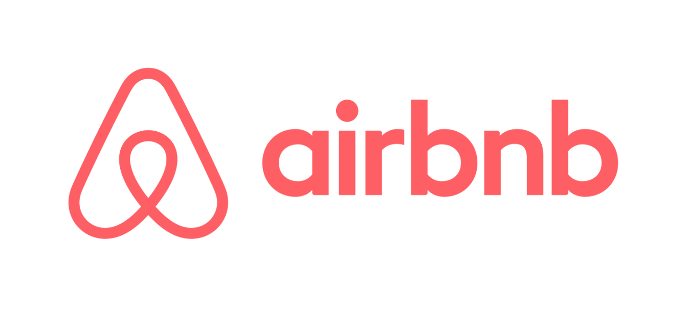

# Airbnb Project

## Study project aimed to explore Airbnb data about accommodations in New York City (2019).

## Data avaiable at: 
[Kaggle - New York City Airbnb Open Data](https://www.kaggle.com/datasets/dgomonov/new-york-city-airbnb-open-data)

## Libraries used in this project:

|library|version|
|:------|:--------|
|folium| 0.12.1.post1
|matplotlib| 3.5.2
|numpy| 1.22.3
|pandas| 1.4.2
|plotly| 5.7.0
|seaborn| 0.11.2

The requirements file can be found [here](/requirements.txt)